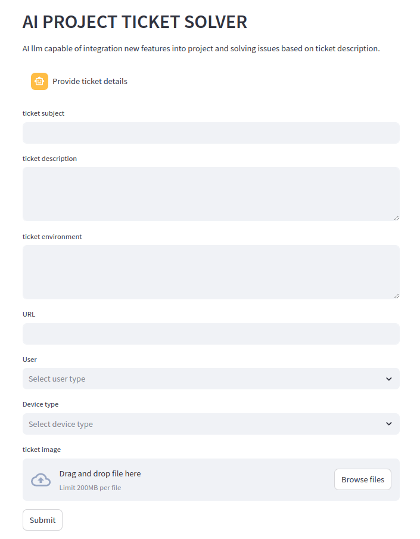

# AI PROJECT TICKET SOLVER
[PROJECT IN PROGRESS]

Introducing tool to solve development tasks and bug fix tickets in large projects.

The tool should search:
- project code
- project documentation 
- framework documentation

and based on retrieved information solve project issues

## 📋 Prerequisites

- Docker and Docker Compose ([Installation Guide](https://docs.docker.com/compose/install/))

## 🛠️ Setup
1. Create .env file and put there your OpenAI API key `OPENAI_API_KEY=your-api-key` 
2. Install python packages with `pip install -r requirements.txt`
3. Start pg_vector db with docker `docker-compose up`
4. Adjust directories names in [initVectorDB.ipynb](notebook/initVectorDB.ipynb) and run this notebook to import project resources into vector db.
5. Start streamlit app with `streamlit run index.py` - it will open application in browser where you can provide details of issue that needs to be solved.

## 👥 Contributing

Found a bug or have an improvement in mind? Please:
- Report issues
- Submit pull requests
- Contact: michal@zarnecki.pl

Your contributions make this project better for everyone!