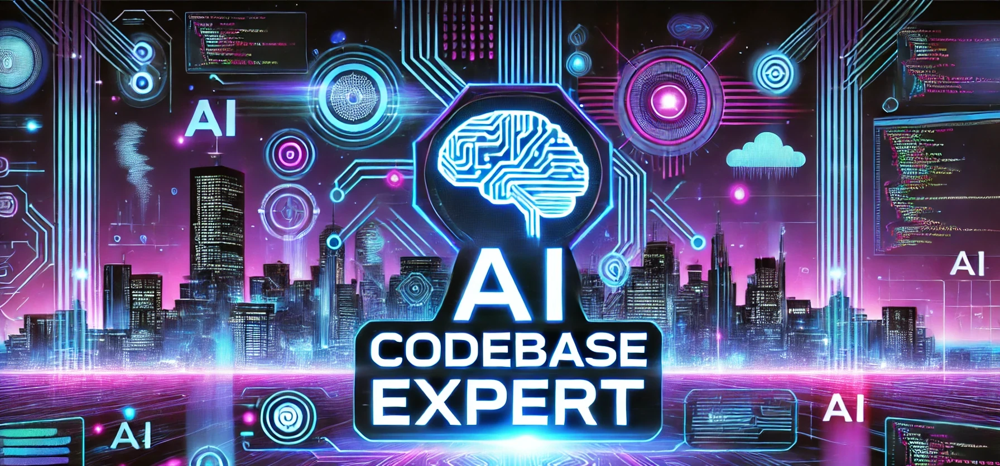
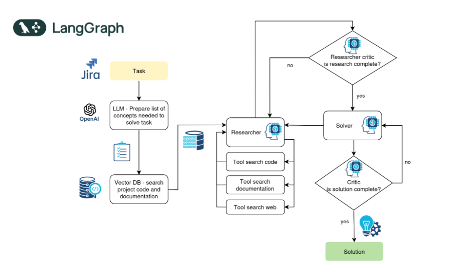

# AI CODEBASE EXPERT

Introducing tool to solve development tasks and bug-fix tickets in large projects.
This project is using GPT-4o LLM and langchain agents to search the project code base and documentation to support development work and fixing issues.

The tool should search:
- project code
- project documentation 
- framework documentation

and based on retrieved information solve project issues

## 📱 Application flow
Tool workflow cycle consist of stages:
1. Prepare important concepts and semantic search message based on provided ticket details.
2. Recognize content from attached image (optional).
3. Search documentation and codebase using retrieval augmented generation technic and documents enhancement with code dependencies graph.
4. Combine prepared concepts, image interpretation and found code samples. Send everything to LLM and get the solution.
5. Repeat points 3-4 until proper solution is found and decide on support actions like searching for more code samples.

## 📋 Prerequisites

- Docker and Docker Compose ([Installation Guide](https://docs.docker.com/compose/install/))

## 🛠️ Setup
1. Create .env file and put there your OpenAI API key `OPENAI_API_KEY=your-api-key` 
2. Install python packages with `pip install -r requirements.txt`
3. Start pg_vector db with docker `docker-compose up`
4. Adjust directories names in [initVectorDB.ipynb](notebook/initVectorDB.ipynb) and run this notebook to import project resources into vector db.
5. Set consts with programming language and framework name on [index.py](index.py):14 
6. Start streamlit app with `streamlit run index.py` - it will open application in browser where you can provide details of issue that needs to be solved.
7. (optional) add JIRA credentials in .env for IRA integration, see [.env-sample](.env-sample)

## 🤖 Processing options
1. Single request to LLM for solution (+ 1 request to get related concepts)

2. Multiple requests to LLM by Agent with retriever tools

3. Multiple requests to LLM by Multi-agent system with dedicated roles and access to retriever tools

improved graph with additional Research Critic node 

## ✔️ Run unit tests
To run unit tests use command below:
`python -m unittest discover test "*Test.py"`

## 👥 Contributing

Found a bug or have an improvement in mind? Please:
- Report issues
- Submit pull requests
- Contact: michal@zarnecki.pl

Your contributions make this project better for everyone!
